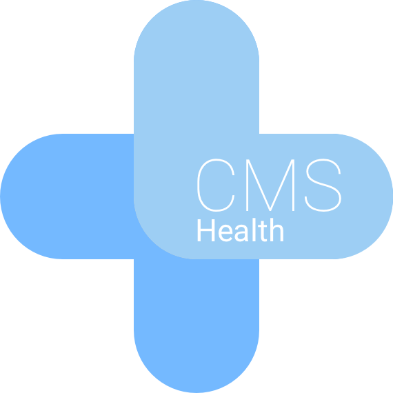

<p align="center">

</p>

# Monitoring Proof of Concept

This is a small PHP application that implements a minimal monitoring service based on the open "CMS Health" standard. This is just a proof of concept and should not be used for production. But feel free to take this code and build a stable, bullet proof solution on top of it.


    
## How to set up the server

### Endpoint Configuration File

### Cronjob

If you want to run the health checks regularly you just have to create a cronjob that runs on your server. One that runs every 15 minutes could look like this.  

```
*/15 * * * * /usr/bin/php /var/www/bin/console app:health:fetch
```
